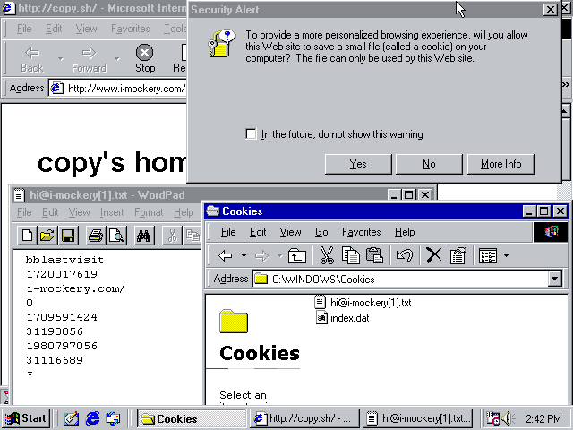

If you've used the Web in the last decade, you'll have seen numerous privacy
disclaimers quoting some variant of the line "Cookies are small text files that
websites place on your computer."

If the average user is tired of constantly being told what cookies are, consider
how frustrating it is for anyone with the technical knowledge to know that _it's
not even true_.

So why do millions of webpages use this exact phrase to describe cookies? In
short, because it more or less _used_ to be true about twenty years ago.

1. Table of Contents
{:toc}

## No, cookies are not small text files

Last year I debunked the
[Twitter mute-list superstition](../comp/twitter-filter-that-never-was.html),
where people shared lists of keywords that you could supposedly mute to block
ads and likes from their timeline. Now I'm debunking an evne more popular claim:
"Cookies are small text files".

To begin with, even if cookies were small text files, it would still be a
strange way to lead into your cookie disclaimer. Nowadays, if a user lacks the
tech-savvy to know what cookies are, they're unlikely to know what a text file
is. They certainly won't know why the file format is relevant. It would make
much more sense to tell the user what information you're storing.

It's fair to say that a cookie is small. According to
[this article](https://paulcalvano.com/2020-07-13-an-analysis-of-cookie-sizes-on-the-web/)
from 2020, 99% of first-party cookies are 287 bytes or less, and
[this article](https://www.tutorialspoint.com/What-is-the-maximum-size-of-a-web-browser-s-cookies-value)
says the major browsers only support cookies about as large as 4,096 bytes.
That was pretty small even in the late 1990s.

However, as one
[2010 Wikipedia talk page post](https://en.wikipedia.org/wiki/Talk:HTTP_cookie/Archive_2#Debunk:_%22Cookies_are_files%22,_%22Cookies_are_stored_as_plain_text%22,_%22Cookies_are_text_files%22)
had to explain to editors, they're not text files:

> Cookies are NOT text "files". They are text strings, which may be stored by
> the user agent (browser) in anyway the developer of the software sees fit. The
> HTTP spec doesn't specify how or where user agents should store such strings.
>
> A browser may store session cookies in volatile memory (RAM) only, while
> storing persistent cookies in non-volatile memory (via a filesystem).
> Different browsers store cookie strings in different ways - most store
> persistent cookies in a single database file within the user's browser
> profile.

According to 
[a 2023 article](https://www.digitalcitizen.life/cookies-location-windows-10/),
which also makes the mistake ("Cookies are tiny files"), none of the major web
browsers today store cookies as individual text files. Chrome, Opera, and Edge
all store cookies in a single non-human-readable file called `Cookies`. Firefox
uses a sqlite database called `cookies.sqlite`. Neither of these are text files.

Internet Explorer, which added cookie support in 1995 and was officially retired
in 2022, did in fact store cookies as files in a folder. Here's the screenshot
again, depicting Windows 98 running Internet Explorer 5.0, a browser released in
1999:

These early versions of IE did store cookies in a plain-text files, and
originally would even notify the user that they were storing a file. However,
each cookie file stored multiple cookies for the same website. Since the minimum
filesystem block size for one file is larger than a typical cookie, it would
have been inefficient to store each cookie as its own file.

Netscape Navigator, the other major browser of the 1990s, also stored cookies in
text, but as rows in a text file instead of individual files.

In short, even back in the 1990s, it wasn't true that a cookie was a small text
file. Rather, cookies were small pieces of textual data stored _in_ text files,
at a time when most PC users would have been been sufficiently tech-savvy to
know what a "text file" is. They were generated server-side and transmitted as
Set-Cookie headers, but at no point was a cookie a file, except arguably when a
site set a single cookie, as depicted in the screenshot.

In the year 2024, no major browser stores its cookies in text files any more.

## Where did the phrase come from?

The exact phrase "Cookies are small text files" can be traced back as far
as 1997. We can compare sources from 1996 and early 1997, which notably did not
make this assertion, to later sources, where the exact phrase quickly became
standard.

When cookies were first introduced, Internet Explorer warned users whenever a
site asked to store a cookie. For example,
[this video](https://www.youtube.com/watch?v=4bvmJ6F8-y0)
shows Internet Explorer 3.01.2723 for Windows 3.1 (running on a more modern
Windows via compatibility layer), a version circa 1996-1997. When the user
visits a site which deploys a Set-Cookie header, they receive this notice:

> Security Alert
>
> You have received a "cookie" (Internet information stored on your computer)
>
> [...]
>
> Do you want to accept it? If you click No, the page you are trying to view may
> not display correctly.

There's no mention of the format in which the cookie is stored. This is also
reflected in the 1996 _Official Microsoft Internet Explorer Book_ by Bryan
Pfaffenberger, detailing Internet Explorer 3:

> Some servers&mdash;mainly commercial ones&mdash;write data to your hard drive
> in files called _cookies_.

By Pfaffenberger's 1997 sequel, the _Official Microsoft Internet Explorer 4
Book_, page 128 debuts the phrase:

> Cookies are small text files that servers store in your computer. They are
> often used for purposes that benefit the user, such as storing passwords and
> other login information. However, they raise privacy issues.

According to this book, Internet Explorer 4 (preview version released 5 April
1997, and final version released 22 September 1997) enables the feature to
accept cookies by default. This change was present in the April 1997 IE4 preview
release, as can be seen 
[in this setup file](https://discmaster.textfiles.com/view/18284/What%20PC%20June%201997.iso/html/res/resource/internet/ie4stw95.zip/Ie4stw95.exe/RCDATA/CABINET/ie4_s1.CAB/IE4_1.CAB/NASHBASE.STF):

    1179    yes            AddRegData    """HKEY_CURRENT_USER"",""Software\Microsoft\Internet Explorer\Advanced Options\Warnings"",""Do not warn before accepting Cookies"",""HKCU\Software\Microsoft\Windows\CurrentVersion\Internet Settings\AllowCookies=TRUE"""   

This
[VMM ISP documentation](https://discmaster.textfiles.com/view/11961/2014.06.ftp.vvm.com.tar/ftp.vvm.com/pub/Win3.x/VVMFiles/vvm3x.hlp)
dated 12 April 1997, certainly referring to IE3 which was the current browser at
the time, demonstrates that many users confused the cookie alert for a security
breach notification, which probably explains why Microsoft disabled the warnings:

> A cookie is a file sent from the server that you are connecting to and it asks
> your computer some information. They are NOT a security breech [sic] and
> [cookie warnings] should be turned off.

At any rate, IE3's dialog box describing a cookie as "Internet information
stored on your computer" is carried over into IE4, as we can see from
[wininet.dll strings](https://discmaster.textfiles.com/view/868/boot-disc-1997-12.iso/Utils/Online/IExplore.4/Win95/IE4SETUP.EXE/RCDATA/CABINET/Wininet.dll/string.txt)
in that version.

However, the [IE4 help file](https://discmaster.textfiles.com/view/868/boot-disc-1997-12.iso/Utils/Online/IExplore.4/Win95/ie4_s5.cab/IE4_5.CAB/IEXPLORE.HLP),
dated 18 September 1997, introduces new documentation to help explain cookies to
unfamiliar users, and which had not appeared in the
[IE3 help file](https://discmaster.textfiles.com/view/11588/ftp.alphant.com.zip/ftp.alphant.com/Internet/msie301b1-axp.exe/RCDATA/CABINET/Iexplore.cab/iexplore.hlp):

> Some Web sites create files on your computer to save information about your
> identity and preferences when visiting that Web site. These files, often
> called "cookies," can store only the information you provide. [...]
> 
> After this file is created for a Web site, information from your computer is
> sent to that Web site whenever you visit it, so that the content and options
> for the Web pages are tailored to you.
> 
> These files are usually stored in your Windows folder—for example,
> C:\Windows\Cookies. If you look in that folder, you will find that these files
> are small, usually less than 2KB each. You cannot edit or view these files
> yourself—they do not record information in plain text.
> 
> If you frequently visit Web sites that request sending and receiving this
> information, and you feel safe storing this information on your computer, make
> sure the check box named In the future, do no show this warning is selected.

Here we see the assertion that the files are small, which is frequently used to
characterize cookies even in sources that don't describe them as text files.

Elsewhere in the IE4 help file, it describes a cookie as a file:

> A cookie is a file sent by an Internet site and stored on your computer, which
> stores information about your identity and preferences when visiting that
> site. For example, if you subscribe to an online magazine, the Internet site
> might download information to your computer so that you can be identified the
> next time you view to that site.

However, the [IE5 beta help file](https://discmaster.textfiles.com/view/23872/PC%20World%20Interactive%2010.iso/share/ayrica/ie5beta/HELPCONT.CAB/iexplore.hlp)
updates this to be more technically correct (note "request" instead of "file",
since the website is sending a HTTP request header, not a file):

> A cookie is a request sent by an Internet site to store information on your
> computer; it stores information about your identity and preferences when
> visiting that site. A persistent cookie is stored as a file on your computer,
> and it remains on your computer when you close Internet Explorer.

However, when we reach the [IE5.0 final help file](https://discmaster.textfiles.com/view/12541/PCMania%20CD81_1.iso/WIN95/FILES95/IE5-95NT.EXE/HELPCONT.CAB/iexplore.hlp)
dated 24 February 1999, the "file" language is back, but with the important
clarification that it is created by the site rather than sent by the site, in
that it doesn't exist as a file until Internet Explorer interprets the
Set-Cookie header to create one:

> A cookie is a file created by an Internet site that stores information about
> you on your computer; such as your identity and preferences when visiting that
> site. A “persistent” cookie is one stored as a file on your computer, and it
> remains there when you close Internet Explorer.

It also clarifies a statement made in the IE4 help file: cookies are stored as
plain text, they're just not intended to be user-readable.

> These files are usually stored in your Windows folder( for example,
> C:\Windows\Cookies). They are small, usually less than 2 kilobytes (KB) each.
> You cannot edit or view cookies yourself; they do not record information in
> plain text. You can open the files by using Notepad or any text editor, but
> the contents you see may not be understandable.

However, it's not `iexplore.hlp` which contains the infamous phrase, but
`iexplore.chm`, using Microsoft's newer help file format. Under
[What you need to know about cookies](https://discmaster.textfiles.com/view/12541/PCMania%20CD81_1.iso/WIN95/FILES95/IE5-95NT.EXE/HELPCONT.CAB/iexplore.chm/sec_cook.htm),
dated 24 February 1999:

> Some Web sites store information in a small text file, called a "cookie," on
> your hard disk.

The same text was already there in [What are cookies?](https://discmaster.textfiles.com/view/23872/PC%20World%20Interactive%2010.iso/share/ayrica/ie5beta/HELPCONT.CAB/iexplore.chm/sec_cook.htm),
the equivalent page of the IE5 beta version help file, dated 3 June 1998:

> Some Web sites store information in a small text file, called a cookie, on
> your hard disk.

The IE5 help file therefore appears to have made the definition "small text
file" official. This was technically true for Internet Explorer 5.

However, it's not the earliest known instance of the phrase. Microsoft
previously used it in the
[glossary page](https://discmaster.textfiles.com/view/19436/on_the_net_04.rar/ON_THE_NET_4.ISO/CDRom/Programas/Personal%20Web%20Server/iis4_06.cab/iigloss.htm)
of the documentation for Microsoft Personal Web Server, dated 22 October 1997,
one month after the release of Internet Explorer 4:

> Cookies are small text files which are stored in the user's browser by the Web
> server.

Earlier than this,
[this webpage](https://discmaster.textfiles.com/view/22903/pcwaug97.zip/pcwaug97/HTML/ROOM/SITE/COOKIES.HTM)
archived from the homepage of _Personal Computer World_, dated 4 February 1997,
makes the assertion that cookies are text files, although without the "small":

> Cookies are text files which remain on your hard drive and are here to make
> life easier for you. With them, your browser can remember things between
> visits to a site.

In short, early web browsers like Internet Explorer and Netscape Navigator did
in fact store their cookies in plain text files, and while technically there was
a difference between the cookie data and the cookie file it was stored in, the
specific statement "cookies are small text files" was spread by Microsoft's own
documentation in 1997, around the release of Internet Explorer 4.

## How did it spread?

A search for the term "Cookies are small text files" at archive.org, sorted by
date of publication, shows hundreds of books published between 1997 and 2024.

Aside from the text "Cookies are small text files", there is a substantial
amount of variance in how the sentence is composed, although always with the
same overall meaning. Cookies may be "sent", "put", "downloaded", "stored",
"created", "embedded", "placed", "saved", "installed", etc; on the user's
"computer", "device", "browser", "hard disk", etc. It may use active or passive
voice.

Evidently (and with gratitude to archive.org's full-text search of millions of
books, a priceless resource which could not be replicated by a traditional
library), the authors of books on the topic paraphrased the previous works on
the topic, leaving the definition of the cookie unchanged.

One of the earliest books to use the exact phrase "Cookies are small text files"
is the 1997 _Official Microsoft Internet Explorer 4 Book_, which did not use the
phrase in its 1996 IE3-based precursor. Since it includes IE4 on an accompanying
CD-ROM, one might assume the book was published no sooner than IE4's official
release date of September 1997.

Another surprising early use of the phrase is in an Information Assurance
document published on 17 September 1997 by the US Joint Chiefs of Staff,
uploaded to archive.org under the title "DTIC ADA339670". It may in fact
pre-date the IE4 book.

_Using Microsoft Site Server_, published in 1997 by Que, also uses the phrase.
The text may possible have appeared in the documentation for Microsoft Site
Server 2.0, since we know that the related product Personal Web Server did
include that definition in its glossary. Site Server 2.0 was released in early
1997, according to Wikipedia, so if its documentation used the phrase, it may be
the earliest recorded use. Unfortunately, I cannot find a copy of Site Server
2.0 English version to test this hypothesis, nor can I independently verify the
precise release date.

It is likely from these official Microsoft sources that a number of books
published in 1998 repeated the definition. From here, it was repeated in
subsequent books on the topic over the years, including for example the _HTML 4
Bible_, _Windows XP for Dummies_, and _Steal This Computer Book 4.0_.

Wikipedia, meanwhile, managed to steer clear of the erroneous definition for a
long time. The
[earliest version](https://en.wikipedia.org/w/index.php?title=HTTP_cookie&oldid=643349689)
of the article "HTTP cookie", dated 2001, refers to it as "A packet of
information". This is consistent until
[24 April 2006](https://en.wikipedia.org/w/index.php?title=HTTP_cookie&direction=next&oldid=49726256),
when it becomes "a parcel of textual information", and on 
[2 May 2006](https://en.wikipedia.org/w/index.php?title=HTTP_cookie&direction=next&oldid=51178342)
that becomes "a parcel of text". It was not until 26 April 2010 that a Wikipedia
editor felt the need to 
[correct users](https://en.wikipedia.org/wiki/Talk:HTTP_cookie/Archive_2#Debunk:_%22Cookies_are_files%22,_%22Cookies_are_stored_as_plain_text%22,_%22Cookies_are_text_files%22)
who had begun adding the erroneous phrase to the page.

The reason for this surge in popularity may quite reasonably have been the 2009
EU cookie law, Directive 2009/136/EC, passed on 25 November 2009. An
[article](https://www.theregister.com/2009/11/25/cookie_law/) about the
legislation, posted the same day by tech site The Register, also used the phrase
"Cookies are small text files". On 1 December 2009,
[a blog post](https://shallowsky.com/blog/tech/web/cookies-are-text-files.html)
complaining about The Register's use of the erroneous term, and included a
screenshot showing that the phrase now returned 1,750,000 Google search results.
By 2009, Internet Explorer was losing market share, mainly to Mozilla Firefox,
particularly among tech-savvy users, and the technical necessity of knowing how
Internet Explorer traditionally stored its cookies was a fading art. By
mid-2010, IE made up less than half of market browser share.

The EU cookie law saw a rush of websites adding some kind of cookie disclaimer
in an effort to comply. Now, even the European Union's own homepage has a
[cookie disclaimer](https://european-union.europa.eu/cookies_en)
which claims "Cookies are small text files". It's such a widely repeated phrase
that almost nobody has stopped to ask if it's true.

## Conclusion

In 1997, Microsoft's official documentation for Internet Explorer and related
products stated that cookies were small text files, which was somewhat true for
the specific implementation used by Internet Explorer at the time. This in turn
became such a widely-repeated definition that people kept saying it long after
it was no longer generally true.

In 2024, cookies are generated server-side as text strings, transmitted through
HTTP Set-Cookie headers, and either held in temporary memory (if they are a
session cookie) or stored by some on the user's device (if a persistent cookie).
A browser may use any method to store persistent cookies, and most browsers
nowadays store all cookies in a single database file, not a text file or set of
text files.
